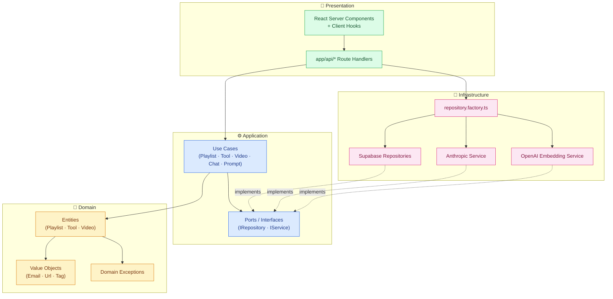
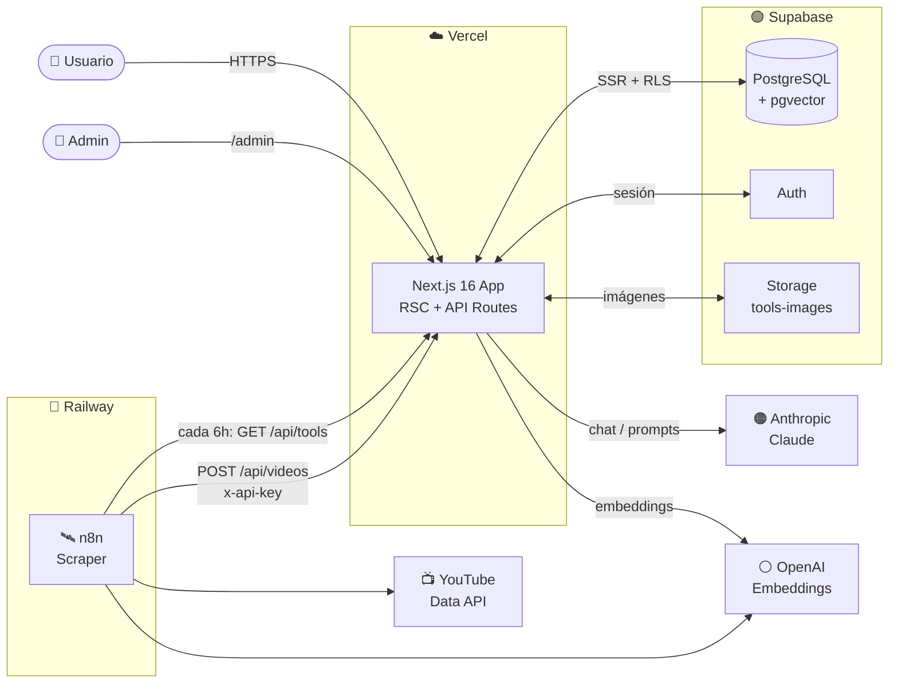

# 🎓 Catálogo de Playlists y Tools de IA de IA

> Proyecto final del **Máster de Desarrollo con IA**.
> Plataforma web para descubrir tools o herramientas de Inteligencia Artificial agrupadas por categorias o playlists. Cada tool cuenta con descripción, enlace a su web oficial y muchas de ellas con videos de YouTube asociados. Dispone de chatbot RAG, generador de prompts, scrapping de Videos de YouTube y panel de administración.

> 🌐 **Demo en vivo**: [proy-mast-des-ia.vercel.app](https://proy-mast-des-ia.vercel.app/)

[](https://proy-mast-des-ia.vercel.app/)
[](https://proy-mast-des-ia.vercel.app/)
[](https://github.com/aran028/Proy-mast-des-ia/actions/workflows/ci.yml)
[](https://nextjs.org/)
[](https://react.dev/)
[](https://www.typescriptlang.org/)
[](https://supabase.com/)
[](https://www.anthropic.com/)
[](https://platform.openai.com/)
[](https://pnpm.io/)
[](#-licencia)

---

## 📑 Tabla de contenidos

1. [Descripción](#-descripción)
2. [Características principales](#-características-principales)
3. [Stack tecnológico](#-stack-tecnológico)
4. [Arquitectura](#-arquitectura)
5. [Requisitos previos](#-requisitos-previos)
6. [Instalación paso a paso](#-instalación-paso-a-paso)
7. [Configuración de servicios](#-configuración-de-servicios)
8. [Variables de entorno](#-variables-de-entorno)
9. [Comandos disponibles](#-comandos-disponibles)
10. [Guía de uso](#-guía-de-uso)
11. [Ejemplos de código](#-ejemplos-de-código)
12. [Tests](#-tests)
13. [CI/CD y despliegue](#-cicd-y-despliegue)
14. [Scraping de vídeos con n8n](#-scraping-de-vídeos-con-n8n)
15. [Roadmap](#-roadmap)
16. [Contribuciones](#-contribuciones)
17. [FAQ](#-faq)
18. [Licencia](#-licencia)
19. [Autores y créditos](#-autores-y-créditos)

---

## 📝 Descripción

**Catálogo de Playlists y Tools de IA** es una plataforma web para **descubrir tools o herramientas de Inteligencia Artificial** agrupadas por categorías o playlists. Cada herramienta cuenta con descripción, enlace a su web oficial. Muchas de ellas cuentasn con vídeos de YouTube asociados.

Además incluye:

- 💬 Un **chatbot con RAG** (Retrieval-Augmented Generation) que resuelve dudas sobre las herramientas indexadas en el catálogo y sobre documentos PDF subidos por el usuario.
- ✨ Un **generador de prompts** asistido por Claude (Anthropic) específico para cada herramienta.
- 🛡️ Un **panel de administración** protegido por autenticación + autorización por rol, que permite gestionar playlists, tools, vídeos y documentos.
- 🤖 Un **scraper automático de vídeos con n8n** (alojado en Railway) que cada pocas horas busca contenido en YouTube, lo clasifica con IA y lo inserta en el catálogo a la espera de aprobación del administrador.

Todo el sistema está construido aplicando **Clean Architecture**, **React Server Components** y buenas prácticas de ingeniería de software como base del trabajo final del máster.

---

## ✨ Características principales

- 🔍 **Exploración de herramientas**: búsqueda y filtrado de tools de IA organizadas por playlists.
- 🎬 **Vídeos asociados**: cada tool puede mostrar vídeos de YouTube embebidos.
- 🔐 **Autenticación**: login y registro con Supabase Auth (email/contraseña + OAuth).
- 👤 **Roles**: usuario estándar y administrador (`profiles.role = 'admin'`).
- 🛠️ **Panel de administración**: CRUD completo de playlists, tools, vídeos y documentos, protegido por rol `admin`.
- 🤖 **Chatbot con RAG**: usa `pgvector` + embeddings de OpenAI + chat de Anthropic (Claude) para responder con contexto del catálogo o de documentos PDF subidos.
- 📄 **Carga de documentos**: subida y parseo de PDFs que se trocean, embeden y se indexan para el chatbot.
- 🎯 **Generador de prompts**: produce prompts optimizados por herramienta a partir de la intención del usuario.
- 🖼️ **Subida de imágenes**: para tools, almacenadas en Supabase Storage.
- 🛰️ **Scraping de vídeos con n8n**: workflow programado que descubre vídeos de YouTube a partir del catálogo, los clasifica por playlist/tool con OpenAI y los envía al endpoint protegido `/api/videos` para revisión admin.
- 🚦 **Rate limiting**: en endpoints sensibles para evitar abuso.
- ✅ **Calidad**: tests unitarios (Vitest) y e2e (Playwright), CI con lint + type-check + tests.

---

## 🧰 Stack tecnológico

| Categoría             | Tecnología                                                  |
| --------------------- | ----------------------------------------------------------- |
| Framework             | Next.js 16 (App Router, React Server Components)            |
| UI                    | React 19, Tailwind CSS v4, shadcn/ui (radix), Lucide React  |
| Base de datos         | Supabase (PostgreSQL) con `@supabase/ssr`                   |
| Búsqueda semántica    | `pgvector` + OpenAI `text-embedding-3-small` (RAG)          |
| LLM (chat / prompts)  | Anthropic Claude (`@anthropic-ai/sdk`, `@ai-sdk/anthropic`) |
| Storage               | Supabase Storage (bucket `tools-images`)                    |
| Validación            | Zod v4                                                      |
| Parseo de PDF         | `pdf-parse`                                                 |
| Automatización / ETL  | n8n self-hosted en Railway (scraping de vídeos YouTube)     |
| Package manager       | pnpm 9                                                      |
| Tests unitarios       | Vitest 4 + Testing Library + jsdom                          |
| Tests e2e             | Playwright                                                  |
| CI                    | GitHub Actions                                              |
| Despliegue            | Vercel                                                      |

---

## 🏛️ Arquitectura

El proyecto implementa **Clean Architecture** en un monolito modular. Las dependencias fluyen siempre **hacia adentro**:

```
presentation → application → domain
                    ↑
             infrastructure
```

```
src/
├── domain/           # Entidades, value objects, eventos, excepciones — sin dependencias externas
├── application/      # Use cases, puertos (interfaces de repositorios y servicios), DTOs
├── infrastructure/   # Implementaciones concretas: Supabase, Anthropic, OpenAI, factories
├── presentation/     # Componentes React, hooks, layouts
└── shared/           # Tipos generados (Supabase), constantes y utilidades transversales

app/                  # Rutas Next.js (App Router) — fuera de src/
├── (pages)/          # Páginas públicas: home, login, register, prompt-generator
├── admin/            # Panel de administración (protegido por rol)
├── api/              # Route handlers REST
│   ├── admin/        # CRUD admin: playlists, tools, videos, documents, chat
│   ├── auth/         # login, check-admin, set-admin
│   ├── chat/         # POST /api/chat (streaming) y parse-document
│   ├── playlists/    # GET público
│   ├── tools/        # GET público
│   ├── videos/       # GET público
│   ├── prompt-generator/
│   └── upload/       # Subida de imágenes
└── auth/callback/    # Callback OAuth de Supabase

supabase/
└── migrations/       # Migraciones SQL (incluye pgvector + RAG)
```

### Diagrama de capas (Clean Architecture)



> Las flechas continuas (`→`) representan dependencias directas. Las flechas discontinuas (`-.implements.->`) muestran cómo `infrastructure` cumple los puertos definidos en `application`, manteniendo la **regla de dependencia hacia adentro**: nada en `domain` o `application` conoce a Supabase, Anthropic ni OpenAI.

### Diagrama de sistema (integraciones externas)



### Decisiones de diseño destacadas

- **Repository pattern**: los use cases dependen de interfaces (`IPlaylistRepository`, `IToolRepository`, `IVideoRepository`, `IVectorRepository`, `IDocumentRepository`) definidas en `application/ports/`. Las implementaciones concretas con Supabase viven en `infrastructure/`.
- **Factory de repositorios** ([repository.factory.ts](src/infrastructure/config/repository.factory.ts)): `createRepositories()` instancia todos los repositorios con cliente RLS-aware; `createAdminRepositories()` usa el `service role` y debe limitarse a endpoints que ya verifican `admin` a nivel aplicación.
- **Admin guard** ([admin.guard.ts](src/infrastructure/config/admin.guard.ts)): `verifyAdmin()` comprueba sesión activa + `profiles.role === 'admin'` antes de procesar cualquier ruta `/api/admin/*`.
- **Servicios externos como puertos**: `IChatService`, `IEmbeddingService`, `IPromptGeneratorService` se inyectan en los use cases (ej. `AskChatbotUseCase`) y tienen implementaciones intercambiables (Anthropic, OpenAI).
- **RAG con pgvector**: los chunks de tools y documentos se embeden con OpenAI y se almacenan en `document_embeddings (vector(1536))`. La función SQL `match_documents()` realiza búsqueda por similitud coseno con índice HNSW.
- **Value Objects**: `Email`, `Url` y `Tag` encapsulan validación e invariantes del dominio en objetos inmutables.
- **Domain exceptions**: jerarquía tipada (`DomainException`, `ValidationException`, `ToolNotFoundException`, `PromptGenerationException`, …) para que los handlers de API puedan mapear cada error a su código HTTP adecuado.

---

## 📦 Requisitos previos

- **Node.js** ≥ 20
- **pnpm** ≥ 9 (`npm install -g pnpm`)
- Una cuenta gratuita en **[Supabase](https://supabase.com)**
- Una API key de **[Anthropic](https://console.anthropic.com/)** (Claude) — requerida para chatbot y generador de prompts
- Una API key de **[OpenAI](https://platform.openai.com/)** — requerida para los embeddings del RAG
- (Opcional) **Supabase CLI** si vas a regenerar tipos: [docs](https://supabase.com/docs/guides/cli)

---

## 🚀 Instalación paso a paso

### 1. Clonar el repositorio

```bash
git clone https://github.com/aran028/Proy-mast-des-ia.git
cd Proy-mast-des-ia
```

### 2. Instalar dependencias

```bash
pnpm install
```

### 3. Configurar variables de entorno

Crea un fichero `.env.local` en la raíz del proyecto. Ver [Variables de entorno](#-variables-de-entorno).

### 4. Aplicar las migraciones de la base de datos

Ejecuta las migraciones SQL en `supabase/migrations/` en tu proyecto de Supabase (vía SQL Editor o `supabase db push`). Esto creará las tablas y la extensión `pgvector` necesaria para el chatbot RAG.

### 5. Configurar Supabase Storage

Sigue [SUPABASE_STORAGE_SETUP.md](SUPABASE_STORAGE_SETUP.md) para crear el bucket `tools-images` y las políticas RLS de subida/lectura/borrado.

### 6. Arrancar en desarrollo

```bash
pnpm dev
```

Abre [http://localhost:3000](http://localhost:3000) 🎉

---

## ⚙️ Configuración de servicios

### 🔵 Supabase

1. Crea un proyecto en [supabase.com](https://supabase.com).
2. En **Project Settings → API**, copia:
   - `Project URL` → `NEXT_PUBLIC_SUPABASE_URL`
   - `anon public key` → `NEXT_PUBLIC_SUPABASE_ANON_KEY`
   - `service_role key` → `SUPABASE_SERVICE_ROLE_KEY` (⚠️ secreto, nunca exponerlo al cliente)
3. Aplica las migraciones de `supabase/migrations/` (incluye `create extension vector` para pgvector).
4. (Opcional) Habilita los proveedores OAuth que quieras usar en **Authentication → Providers**.

### 🟣 pgvector + RAG

La migración [`20260428000000_chatbot_rag.sql`](supabase/migrations/20260428000000_chatbot_rag.sql) crea:

- Extensión `vector`.
- Tabla `documents` con metadatos del PDF subido.
- Tabla `document_embeddings` con `vector(1536)` (compatible con `text-embedding-3-small`).
- Índice **HNSW** con `vector_cosine_ops` para búsquedas rápidas por similitud.
- Función SQL `match_documents(query_embedding, match_threshold, match_count)` para recuperar los chunks más relevantes.
- Políticas RLS para lectura por usuarios autenticados.

Si cambias de modelo de embeddings, recuerda ajustar la dimensión del vector y reindexar el catálogo desde **Admin → Reindexar catálogo** (`POST /api/admin/chat/reindex-catalog`).

### 🟠 Anthropic (Claude)

1. Crea una API key en [console.anthropic.com](https://console.anthropic.com/settings/keys).
2. Añádela como `ANTHROPIC_API_KEY` en `.env.local`.
3. (Opcional) Personaliza el modelo con `ANTHROPIC_MODEL` (por defecto `claude-sonnet-4-5`).

### 🟢 OpenAI (embeddings)

1. Crea una API key en [platform.openai.com](https://platform.openai.com/api-keys).
2. Añádela como `OPENAI_API_KEY` en `.env.local`.
3. (Opcional) Personaliza el modelo con `OPENAI_EMBEDDING_MODEL` (por defecto `text-embedding-3-small`, dim 1536).

### 👑 Crear el primer admin

Tras registrarte en la app:

```sql
-- En el SQL Editor de Supabase
update public.profiles
set role = 'admin'
where id = '<uuid-del-usuario>';
```

A partir de ese momento podrás acceder a `/admin`.

---

## 🔐 Variables de entorno

Crea `.env.local` en la raíz con las siguientes claves:

```bash
# === Supabase (obligatorias) ===
NEXT_PUBLIC_SUPABASE_URL=https://xxxxxxxx.supabase.co
NEXT_PUBLIC_SUPABASE_ANON_KEY=eyJhbGci...
SUPABASE_SERVICE_ROLE_KEY=eyJhbGci...           # solo servidor — NO commitear

# === Anthropic / Claude (obligatoria para chat y prompts) ===
ANTHROPIC_API_KEY=sk-ant-...
ANTHROPIC_MODEL=claude-sonnet-4-5               # opcional

# === OpenAI / Embeddings (obligatoria para RAG) ===
OPENAI_API_KEY=sk-...
OPENAI_EMBEDDING_MODEL=text-embedding-3-small   # opcional

# === n8n / Scraping de vídeos (opcional, recomendado) ===
N8N_API_KEY=xxxxxxxxxxxxxxxxxxxxxxxxxxxxxxxx   # clave que n8n envía en x-api-key al POSTear vídeos
N8N_WEBHOOK_URL=https://n8n-production-xxxx.up.railway.app

# === Solo para regenerar tipos con `pnpm db:types` ===
SUPABASE_PROJECT_ID=xxxxxxxx
```

> ⚠️ **Nunca commitees `.env.local`**. Está incluido en `.gitignore`.

| Variable                          | Obligatoria | Usada por                                        |
| --------------------------------- | :---------: | ------------------------------------------------ |
| `NEXT_PUBLIC_SUPABASE_URL`        | ✅          | Cliente y servidor (Supabase)                    |
| `NEXT_PUBLIC_SUPABASE_ANON_KEY`   | ✅          | Cliente y servidor (Supabase)                    |
| `SUPABASE_SERVICE_ROLE_KEY`       | ✅          | Solo servidor — bypass RLS en endpoints admin    |
| `ANTHROPIC_API_KEY`               | ✅          | Chatbot, generador de prompts                    |
| `ANTHROPIC_MODEL`                 | ⬜          | Override del modelo (default: `claude-sonnet-4-5`) |
| `OPENAI_API_KEY`                  | ✅          | Generación de embeddings (RAG)                   |
| `OPENAI_EMBEDDING_MODEL`          | ⬜          | Override del modelo (default: `text-embedding-3-small`) |
| `N8N_API_KEY`                     | ⬜          | Autentica al workflow de n8n cuando hace `POST /api/videos` |
| `N8N_WEBHOOK_URL`                 | ⬜          | URL pública de la instancia de n8n en Railway     |
| `SUPABASE_PROJECT_ID`             | ⬜          | Solo para `pnpm db:types`                        |

---

## 🛠️ Comandos disponibles

```bash
pnpm dev          # Servidor de desarrollo con hot-reload
pnpm build        # Build de producción
pnpm start        # Servidor de producción (requiere build previo)
pnpm lint         # Análisis estático con ESLint
pnpm tsc --noEmit # Verificación de tipos sin emitir ficheros
pnpm test         # Tests unitarios en modo watch
pnpm test:run     # Tests unitarios (ejecución única, modo CI)
pnpm test:ui      # Tests unitarios con UI de Vitest
pnpm test:e2e     # Tests e2e con Playwright
pnpm test:e2e:ui  # Tests e2e con UI de Playwright
pnpm db:types     # Regenerar tipos TypeScript desde el esquema de Supabase
```

Ejecutar un único fichero de test:

```bash
pnpm vitest run src/application/use-cases/playlist/__tests__/CreatePlaylistUseCase.test.ts
```

Verificar todo localmente antes de hacer push (mismo pipeline que CI):

```bash
pnpm tsc --noEmit && pnpm lint && pnpm test:run
```

---

## 🎮 Guía de uso

### Como visitante

1. Visita la home en `/`.
2. Explora las **playlists** y entra en cualquiera para ver las tools que contiene.
3. En cada tool encontrarás descripción, enlace a la web oficial y vídeos asociados.

### Como usuario registrado

1. Regístrate en `/register` o inicia sesión en `/login`.
2. Accede al **dashboard** y al **chatbot** para resolver dudas con contexto del catálogo.
3. Sube un **PDF** al chat para hacerle preguntas sobre su contenido (RAG).
4. Usa el **generador de prompts** en `/prompt-generator` para obtener prompts optimizados para una herramienta concreta.

### Como administrador

1. Tras crear tu cuenta, haz `update profiles set role = 'admin'` en Supabase.
2. Accede a `/admin` y gestiona:
   - **Playlists** (categorías de herramientas)
   - **Tools** (herramientas con imagen, descripción, enlace, tags)
   - **Videos** (asociados a una playlist o tool)
   - **Documents** (PDFs indexados para el chatbot RAG)
   - **Reindexación del catálogo** para regenerar embeddings

---

## 💻 Ejemplos de código

### Endpoint público — listar playlists

```ts
// app/api/playlists/route.ts
import { NextResponse } from 'next/server'
import { createRepositories } from '@/infrastructure/config/repository.factory'
import { GetAllPlaylistsUseCase } from '@/application/use-cases/playlist'

export async function GET() {
  try {
    const { playlist } = await createRepositories()
    const data = await new GetAllPlaylistsUseCase(playlist).execute()
    return NextResponse.json({ success: true, data })
  } catch (error: unknown) {
    const message = error instanceof Error ? error.message : 'Error desconocido'
    return NextResponse.json({ success: false, error: message }, { status: 500 })
  }
}
```

### Endpoint de chat con streaming (SSE) y RAG

```ts
// app/api/chat/route.ts (extracto)
const { vector } = await createRepositories()
const useCase = new AskChatbotUseCase(
  getEmbeddingService(),   // OpenAI text-embedding-3-small
  vector,                  // pgvector via Supabase
  getChatService(),        // Anthropic Claude
)

const stream = await useCase.execute({
  messages: body.messages,
  attachedDocument: body.attachedDocument,
})

// Se devuelve como text/event-stream con chunks { type: 'text', value: '...' }
```

Cliente:

```ts
const res = await fetch('/api/chat', {
  method: 'POST',
  headers: { 'Content-Type': 'application/json' },
  body: JSON.stringify({ messages: [{ role: 'user', content: '¿Qué hace Cursor?' }] }),
})

const reader = res.body!.getReader()
const decoder = new TextDecoder()
while (true) {
  const { value, done } = await reader.read()
  if (done) break
  // parsear líneas SSE: `data: {"type":"text","value":"..."}\n\n`
}
```

### Generador de prompts — validación con Zod + manejo de errores tipados

```ts
// app/api/prompt-generator/route.ts (extracto)
const bodySchema = z.object({
  toolId: z.string().min(1),
  userIntent: z.string().min(10).max(1000),
})

const { tool } = await createRepositories()
const useCase = new GeneratePromptUseCase(tool, getPromptGeneratorService())
const result = await useCase.execute(parsed.data)
return NextResponse.json({ success: true, data: result })
```

Las excepciones de dominio se mapean a códigos HTTP semánticos (`ToolNotFoundException` → 404, `ToolNotPromptEnabledException` → 422, `PromptGenerationException` → 502, …).

### Wrapper del cliente Supabase (Server Components)

```ts
// src/infrastructure/database/supabase/server.ts (extracto)
import { createServerClient } from '@supabase/ssr'

export async function createClient() {
  return createServerClient(
    process.env.NEXT_PUBLIC_SUPABASE_URL!,
    process.env.NEXT_PUBLIC_SUPABASE_ANON_KEY!,
    { cookies: { /* lectura/escritura desde next/headers */ } },
  )
}
```

---

## 🧪 Tests

El proyecto incluye **tests unitarios** para entidades de dominio, value objects y todos los use cases de la capa de aplicación, además de **tests e2e** con Playwright.

### Cobertura por módulo

```
src/
├── domain/
│   ├── entities/__tests__/        # playlist, tool, video
│   └── value-objects/__tests__/   # Url, Tag
└── application/use-cases/
    ├── playlist/__tests__/        # 5 use cases (CRUD + queries)
    ├── tool/__tests__/            # 6 use cases (CRUD + queries + búsqueda)
    ├── video/__tests__/           # 6 use cases
    ├── chat/__tests__/            # AskChatbot, IndexDocument, DeleteDocument
    └── prompt-generator/__tests__/# GeneratePrompt
```

### Convenciones de testing

- Los repositorios se **mockean** implementando su interfaz con `vi.fn()` por método.
- `vi.useFakeTimers()` + `vi.setSystemTime()` cuando un use case genera `updated_at`.
- `vi.spyOn(Entity, 'create')` para verificar la delegación de validación.
- `vi.clearAllMocks()` en `beforeEach`.

### Ejecutar tests

```bash
pnpm test:run                                  # Todos los unitarios (single run)
pnpm test                                      # Unitarios en modo watch
pnpm vitest run src/domain                     # Solo dominio
pnpm test:e2e                                  # E2E con Playwright (requiere servidor)
```

---

## 🚢 CI/CD y despliegue

### GitHub Actions

El pipeline ([`.github/workflows/ci.yml`](.github/workflows/ci.yml)) se ejecuta en cada push y pull request a `main` con dos jobs en paralelo:

| Job                  | Pasos                                             |
| -------------------- | ------------------------------------------------- |
| **Lint & Type-check**| `pnpm tsc --noEmit` · `pnpm lint` · `pnpm audit`  |
| **Test**             | `pnpm test:run`                                   |

### Despliegue en Vercel

1. Entra en [vercel.com/new](https://vercel.com/new) → importa tu repo de GitHub.
2. Vercel detectará Next.js automáticamente.
3. En **Project Settings → Environment Variables**, añade todas las variables del bloque [Variables de entorno](#-variables-de-entorno).
4. Cada `push` a `main` desplegará a producción; cada PR creará un *preview deploy*.

> 💡 Si usas **Vercel Edge**, recuerda que las rutas con `runtime = 'nodejs'` (ej. `/api/chat`) seguirán ejecutándose en Node — necesario para `pdf-parse` y los SDK de OpenAI/Anthropic.

---

## 🛰️ Scraping de vídeos con n8n

Para mantener el catálogo de vídeos vivo sin trabajo manual, el proyecto integra un **workflow de [n8n](https://n8n.io/) self-hosted en Railway** que descubre y clasifica vídeos de YouTube de forma automática.

### Cómo funciona

```
Schedule (cada 6h)
  → GET /api/tools                         (obtiene el catálogo actual)
  → Code: genera queries de búsqueda       (por nombre de tool y tags)
  → Split In Batches
  → YouTube Data API v3 (search)           (3 vídeos por query)
  → OpenAI gpt-4o-mini                     (clasifica en playlist + tool + tags)
  → IF confidence > 0.7
  → POST /api/videos  (header x-api-key)   (inserta con status='pending')
```

Los vídeos llegan a la app con `status='pending'` y aparecen en `/admin/videos`, donde el administrador los **aprueba o rechaza** antes de hacerlos visibles a los usuarios. Esto mantiene un humano en el bucle y evita inflar el catálogo con falsos positivos del clasificador.

### Stack del scraper

| Componente              | Rol                                                        |
| ----------------------- | ---------------------------------------------------------- |
| **n8n** en Railway      | Orquestación del workflow (Schedule + nodos HTTP/Code/IF)  |
| **YouTube Data API v3** | Fuente de vídeos (gratis hasta 10k unidades/día)           |
| **OpenAI `gpt-4o-mini`**| Clasificación automática a playlist/tool con score         |
| **`POST /api/videos`**  | Endpoint protegido con `x-api-key` (`N8N_API_KEY`)         |
| **Admin moderation**    | `/admin/videos` para aprobar/rechazar lo entrante          |

### Plantilla del workflow

El workflow exportado está versionado en [`YouTube Video Scraper.json`](YouTube%20Video%20Scraper.json) — puedes importarlo desde n8n (**Workflows → Import from File**) y solo tendrás que rellenar credenciales y URLs.

### Configuración

Toda la guía paso a paso (deploy en Railway, claves de YouTube/OpenAI, plantilla del workflow, troubleshooting y costes estimados) está en [N8N_SETUP.md](N8N_SETUP.md). Resumen rápido:

1. Despliega n8n con la plantilla de Railway y configura `N8N_BASIC_AUTH_*`.
2. Genera una API key fuerte y añádela como `N8N_API_KEY` en `.env.local` y en Vercel.
3. Importa el workflow [`YouTube Video Scraper.json`](YouTube%20Video%20Scraper.json) y rellena tus credenciales de YouTube y OpenAI.
4. Activa el workflow → cada 6 h se ejecuta y los vídeos aparecerán en `/admin/videos` listos para aprobar.

> 💸 Coste aproximado del pipeline: **~5-15 €/mes** entre Railway (~$5), YouTube API (gratis dentro de cuota) y OpenAI `gpt-4o-mini` (~$0.01/día con uso normal).

---

## 🗺️ Roadmap

- [x] CRUD de playlists, tools y vídeos
- [x] Autenticación y panel de administración con roles
- [x] Chatbot con RAG (pgvector + Anthropic + OpenAI)
- [x] Generador de prompts por herramienta
- [x] Subida y parseo de documentos PDF
- [x] Scraping automático de vídeos de YouTube con n8n + clasificación por IA
- [x] Tests unitarios para dominio y aplicación
- [ ] Tests e2e completos para flujos críticos
- [ ] Internacionalización (i18n) ES/EN
- [ ] Modo oscuro persistido en perfil
- [ ] Favoritos por usuario y playlists personales
- [ ] Métricas de uso del chatbot (latencia, hits/misses de RAG)
- [ ] Soporte multi-modelo en el chat (selector Claude / GPT)
- [ ] Extender el scraper de n8n a Instagram, TikTok y Vimeo

---

## 🤝 Contribuciones

¡Las contribuciones son bienvenidas! Para colaborar:

1. Haz un **fork** del repositorio.
2. Crea una rama: `git checkout -b feat/mi-mejora`.
3. Haz tus cambios siguiendo las convenciones del proyecto:
   - Archivos en **kebab-case**, clases y componentes en **PascalCase**.
   - Tests para todo nuevo use case o entidad.
   - Verifica localmente: `pnpm tsc --noEmit && pnpm lint && pnpm test:run`.
4. Haz commit (`git commit -m "feat: añade X"`) y push.
5. Abre un **Pull Request** describiendo el qué y el porqué.

> Para cambios grandes, abre antes una **issue** para discutir la propuesta.

---

## ❓ FAQ

**¿Por qué Clean Architecture en un proyecto Next.js?**
Para desacoplar la lógica de negocio del framework y de Supabase. Los use cases pueden testearse sin levantar Next.js ni la base de datos, y migrar de Supabase a otro provider implicaría cambiar solo `infrastructure/`.

**¿Por qué Anthropic *y* OpenAI?**
Cada modelo se usa para lo que mejor hace: Claude para razonamiento conversacional y generación de prompts, OpenAI `text-embedding-3-small` por su excelente relación calidad/precio para embeddings y por su dimensión (1536) ya integrada en la migración pgvector.

**¿Necesito el `service_role` key?**
Sí, para los endpoints `/api/admin/*` que necesitan saltarse RLS tras verificar el rol a nivel aplicación con `verifyAdmin()`. **Nunca** lo expongas al cliente.

**¿Cómo me convierto en admin la primera vez?**
Regístrate normalmente y luego ejecuta `update public.profiles set role = 'admin' where id = '<tu-uuid>';` en el SQL Editor de Supabase.

**El chatbot no encuentra mis tools, ¿qué pasa?**
Probablemente el catálogo no está indexado. Entra como admin y ejecuta la **reindexación del catálogo** (`POST /api/admin/chat/reindex-catalog`) o súbelo desde el panel.

**¿Por qué `runtime = 'nodejs'` en `/api/chat`?**
Porque `pdf-parse` y los SDK oficiales de OpenAI/Anthropic requieren APIs de Node no disponibles en Edge runtime.

**¿Es obligatorio desplegar n8n?**
No. La app funciona sin el scraper — los vídeos pueden añadirse manualmente desde `/admin/videos`. n8n solo se encarga de descubrirlos y pre-clasificarlos automáticamente. Si decides activarlo, sigue [N8N_SETUP.md](N8N_SETUP.md) y define `N8N_API_KEY` para que `/api/videos` valide su origen.

---

## 📄 Licencia

Distribuido bajo la licencia **MIT**. Consulta el archivo `LICENSE` (si está presente) o añade uno con `pnpm dlx license-cli MIT` para más detalles.

---

## 👥 Autores y créditos

- **Aran** — autor principal — [@aran028](https://github.com/aran028)

Proyecto desarrollado como **Trabajo Fin de Máster** del *Máster en Desarrollo de Aplicaciones con IA*.

### Agradecimientos

- Al equipo del máster por la formación y la guía durante el proyecto.
- A las comunidades de **Next.js**, **Supabase**, **Anthropic** y **OpenAI** por la documentación y los SDKs que han hecho posible este trabajo.

---

<p align="center">
  Hecho con ❤️ y mucha ☕ usando <strong>Next.js 16</strong>, <strong>Clean Architecture</strong> y un poco de <strong>IA</strong>.
</p>
